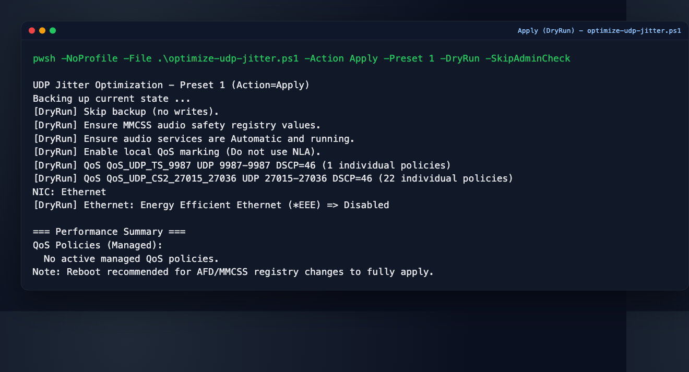
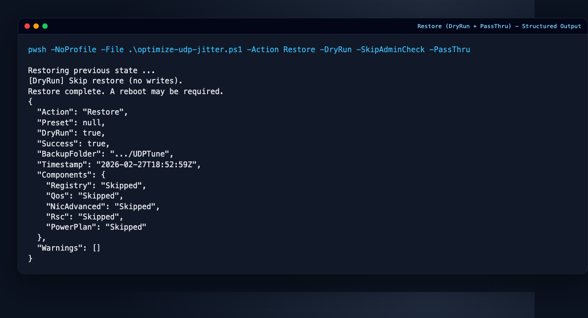
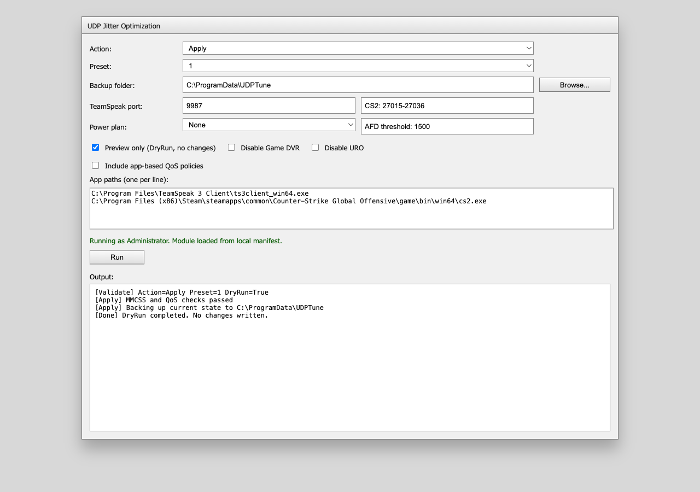

# ⚠️ This repository has been deprecated

**What this was:** A tool to reduce UDP jitter (inconsistent packet timing) on Windows -- the #1 cause of lag spikes, rubber-banding, and choppy voice chat in games like CS2 and apps like TeamSpeak. It applied network card tuning, QoS priority tagging, and Windows registry tweaks to make your connection more consistent.

This project is no longer maintained. All settings from this repo have been reviewed, and the evidence-based ones have been incorporated into the successor project:

### ➡️ [cs2-opt](https://github.com/sebastianspicker/cs2-opt)

The new repo covers NIC tuning, interrupt affinity, DSCP/QoS, power management, and more — with a modern GUI and full backup/restore workflow, grounded in empirical testing.

Several settings from this repo (e.g. `NetworkThrottlingIndex=0xFFFFFFFF`, `InterruptModeration=Disabled`, UDP checksum offload disable) were found to have no measurable benefit or adverse effects in the new project's research, and are intentionally excluded.

---

<details>
<summary>Original README (archived)</summary>

# UDP Jitter Optimization for Windows 10/11

Reduce lag spikes, rubber-banding, and choppy voice chat in competitive games and VoIP apps. UDP jitter is the variation in packet delivery timing — even on a fast connection, inconsistent timing causes stuttering. This tool applies network card tuning, QoS priority tagging, and Windows registry tweaks to keep your packets flowing smoothly.

PowerShell module and scripts with safety-first defaults, full backup/restore, and preset-based tuning.

## Highlights

- Endpoint QoS DSCP marking (`EF=46`) for TeamSpeak/CS2 ports and optional app policies.
- Three presets (`1=Safe`, `2=Moderate`, `3=Aggressive`) with evidence-based setting classification.
- Full backup/restore workflow for registry, QoS, NIC advanced properties, RSC, and power plan.
- CLI and WinForms GUI.

## Requirements

- Windows 10/11
- PowerShell 7+
- Run elevated for apply/backup/restore/reset

## Quick Start

```powershell
# Optional for current session
Set-ExecutionPolicy -Scope Process -ExecutionPolicy Bypass

# Apply conservative preset
pwsh -NoProfile -ExecutionPolicy Bypass -File .\optimize-udp-jitter.ps1 -Action Apply -Preset 1

# Preview only
pwsh -NoProfile -ExecutionPolicy Bypass -File .\optimize-udp-jitter.ps1 -Action Apply -Preset 2 -DryRun

# Backup and restore
pwsh -NoProfile -ExecutionPolicy Bypass -File .\optimize-udp-jitter.ps1 -Action Backup
pwsh -NoProfile -ExecutionPolicy Bypass -File .\optimize-udp-jitter.ps1 -Action Restore
```

## Screenshots

CLI `Apply -DryRun`:



CLI `Restore -PassThru`:



GUI (WinForms):



## GUI

```powershell
Set-ExecutionPolicy -Scope Process -ExecutionPolicy Bypass
.\optimize-udp-jitter-gui.ps1
```

The GUI supports Apply/Backup/Restore/ResetDefaults and action-specific options (ports, app policies, AFD threshold, power plan, DryRun, GameDVR/URO toggles).

## Module Usage

```powershell
Import-Module .\WindowsUdpJitterOptimization\WindowsUdpJitterOptimization.psd1 -Force
Invoke-UdpJitterOptimization -Action Apply -Preset 1

# Structured result for automation
Invoke-UdpJitterOptimization -Action Restore -PassThru
```

## Key Parameters

- `-Action`: `Apply`, `Backup`, `Restore`, `ResetDefaults`
- `-Preset`: `1`, `2`, `3` (Apply only)
- `-IncludeAppPolicies`, `-AppPaths`
- `-AfdThreshold`
- `-PowerPlan`: `None`, `HighPerformance`, `Ultimate`
- `-DisableGameDvr`, `-DisableUro`
- `-IncludeExperimental`: Apply TCP-only, WoL-only, and unproven settings alongside any preset.
- `-BackupFolder`
- `-AllowUnsafeBackupFolder` (override safety block for system paths)
- `-DryRun`
- `-PassThru`

## Validation and CI

```bash
./scripts/ci-local.sh
```

Runs PSScriptAnalyzer and Pester locally (same checks as CI).

## Documentation

- Technical documentation: [docs/DOCUMENTATION.md](docs/DOCUMENTATION.md)

## Security

Do not share sensitive local data from backups or logs in public issues.
See [SECURITY.md](SECURITY.md).

</details>
