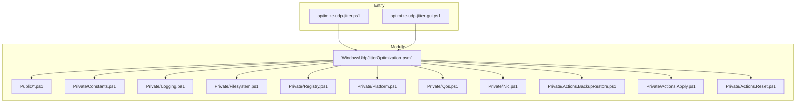

# Windows UDP Jitter Optimization - Technical Documentation

Technical reference for the module, CLI wrapper, and GUI.

## Contents

- Overview
- Architecture
- Public interfaces and parameters
- Action flows
- Backup and restore model
- Known Limitations
- Fix History (condensed)
- Operational Troubleshooting
- Development and validation

## Overview

The project optimizes UDP latency variance on Windows by combining:

- QoS DSCP marking (`EF=46`) on selected ports/apps
- Local QoS registry enablement (`Do not use NLA`)
- Preset-based NIC and networking tuning
- Full backup and restore support before/after changes

Primary entrypoints:

- CLI wrapper: `optimize-udp-jitter.ps1`
- GUI: `optimize-udp-jitter-gui.ps1`
- Module function: `Invoke-UdpJitterOptimization`

## Architecture


```mermaid
flowchart TB
  subgraph "Entry"
    CLI["optimize-udp-jitter.ps1"]
    GUI["optimize-udp-jitter-gui.ps1"]
  end

  subgraph "Module"
    PSM["WindowsUdpJitterOptimization.psm1"]
    PUB["Public/*.ps1"]
    C["Private/Constants.ps1"]
    L["Private/Logging.ps1"]
    F["Private/Filesystem.ps1"]
    R["Private/Registry.ps1"]
    P["Private/Platform.ps1"]
    Q["Private/Qos.ps1"]
    N["Private/Nic.ps1"]
    ABR["Private/Actions.BackupRestore.ps1"]
    AA["Private/Actions.Apply.ps1"]
    AR["Private/Actions.Reset.ps1"]
  end

  CLI --> PSM
  GUI --> PSM
  PSM --> C
  PSM --> L
  PSM --> F
  PSM --> R
  PSM --> P
  PSM --> Q
  PSM --> N
  PSM --> ABR
  PSM --> AA
  PSM --> AR
  PSM --> PUB
```

Module load order is deterministic:

1. `Constants.ps1`
2. Ordered private scripts (`Logging`, `Filesystem`, `Registry`, `Platform`, `Qos`, `Nic`, `Actions.*`)
3. Ordered public scripts (`Get-UjDefaultBackupFolder`, `Invoke-UdpJitterOptimization`)

## Setting Classifications

Every optimization in this tool is classified into a tier based on how well-proven it is and what tradeoffs it has. **If you're not sure which preset to pick, start with Preset 1 (Safe) and work up only if you want more.**

- **Tier 1 (Safe):** No downside whatsoever. These are universally recommended.
- **Tier 2 (Moderate):** Proven effective, but use slightly more CPU. Good for gaming PCs with headroom.
- **Tier 3 (Aggressive):** Maximum optimization, but noticeably higher CPU. Best for dedicated gaming rigs.
- **Experimental:** Not proven to help with UDP/gaming. Only for testing or curiosity.

### Tier 1 - Safe (Preset 1)

Zero-risk settings with no measurable tradeoffs. Recommended for everyone.

| Setting | Mechanism | Impact |
|---------|-----------|--------|
| QoS DSCP marking (EF=46) | `New-NetQosPolicy` | HIGH (network-dependent) |
| "Do not use NLA" = 1 | Registry | Enabler for DSCP |
| Disable EEE (`*EEE`) | NIC property | MEDIUM - eliminates link wake latency |
| Disable Green Ethernet (`*GreenEthernet`) | NIC property | LOW-MEDIUM - vendor-specific EEE |
| Disable Power Saving Mode (`*PowerSavingMode`) | NIC property | LOW-MEDIUM - driver power management |
| Start MMCSS service | Service | Enabler for throttling settings |
| SystemResponsiveness = 20 | Registry | LOW - conservative MMCSS tuning |

### Tier 2 - Moderate (Preset 2 adds these on top of Tier 1)

Proven settings with small, documented tradeoffs (slightly higher CPU load -- typically 1-5% more).

| Setting | Mechanism | Impact | Tradeoff |
|---------|-----------|--------|----------|
| Disable Interrupt Moderation (`*InterruptModeration`) | NIC property | HIGH | +1-5% CPU interrupt load |
| Disable Flow Control (`*FlowControl`) | NIC property | MEDIUM | Rare packet loss on congested links |
| AFD FastSendDatagramThreshold = 1500 | Registry | MEDIUM | None |
| NetworkThrottlingIndex = 0xFFFFFFFF | Registry | MEDIUM-HIGH | Slightly more CPU during multimedia |
| SystemResponsiveness = 10 | Registry | LOW-MEDIUM | Less CPU for background tasks |

### Tier 3 - Aggressive (Preset 3 adds these on top of Tiers 1 and 2)

Maximum UDP optimization with measurable tradeoffs. Best for PCs with CPU headroom.

| Setting | Mechanism | Impact | Tradeoff |
|---------|-----------|--------|----------|
| Disable URO | netsh | HIGH | Reduced bulk UDP throughput |
| Disable UDP Checksum Offload | NIC property | LOW-MEDIUM | +1-3% CPU |
| InterruptModerationRate = 0 | NIC property | LOW | Belt-and-suspenders for IM |
| SystemResponsiveness = 0 | Registry | LOW-MEDIUM | Can starve background processes |

### Experimental (`-IncludeExperimental` flag)

These settings are **not proven to help with gaming or VoIP**. They are TCP-only, sleep/Wake-on-LAN only, or unproven. Applied on top of any preset if you enable the flag, but skipped by default.

| Setting | Why experimental |
|---------|-----------------|
| TCP Checksum Offload disable | TCP-only, zero UDP effect |
| LSO v2 disable | TCP segmentation, zero UDP effect |
| RSC disable | TCP-only coalescing |
| ARP Offload disable | Sleep-only, no active-use effect |
| NS Offload disable | Sleep-only, no active-use effect |
| Wake on Magic Packet disable | Sleep-only |
| Wake on Pattern Match disable | Sleep-only |
| WOL & Shutdown Link Speed disable | Sleep/shutdown-only |
| Jumbo Packet disable | Usually already disabled (no-op) |
| Receive/Transmit Buffers = 256 | Potentially counterproductive |
| MMCSS Audio Task tuning | Audio scheduling, not UDP network |

## Public Interfaces and Parameters

### Exported functions

- `Invoke-UdpJitterOptimization`
- `Get-UjDefaultBackupFolder`
- `Test-UjIsAdministrator`

### Core parameters (`Invoke-UdpJitterOptimization`)

- `-Action`: `Apply | Backup | Restore | ResetDefaults`
- `-Preset`: `1 | 2 | 3` (Apply only)
- `-TeamSpeakPort`, `-CS2PortStart`, `-CS2PortEnd`
- `-IncludeAppPolicies`, `-AppPaths`
- `-AfdThreshold`
- `-PowerPlan`: `None | HighPerformance | Ultimate`
- `-DisableGameDvr`, `-DisableUro`
- `-IncludeExperimental`: Apply TCP-only, WoL-only, and unproven settings on top of any preset.
- `-BackupFolder`
- `-AllowUnsafeBackupFolder`
- `-DryRun`
- `-PassThru`
- `-SkipAdminCheck`

### `-PassThru` result schema

Returned object:

- `Action` (string)
- `Preset` (int or null)
- `IncludeExperimental` (bool or null)
- `DryRun` (bool)
- `Success` (bool)
- `BackupFolder` (string or null)
- `Timestamp` (datetime)
- `Components` (ordered hashtable, component -> `OK|Warn|Skipped`)
- `Warnings` (string[])

## Action Flows

### Apply

1. Validate input and admin context (unless `-SkipAdminCheck`)
2. Validate backup path safety (unless `-AllowUnsafeBackupFolder`)
3. Backup state
4. Start MMCSS service, set SystemResponsiveness (preset-dependent: 20/10/0)
5. Enable local QoS marking, create DSCP policies
6. Apply NIC configuration (tiered keywords + optional experimental)
7. Apply AFD threshold (Preset 2+), NetworkThrottlingIndex (Preset 2+)
8. Disable URO (Preset 3 or `-DisableUro`)
9. Set power plan (if `-PowerPlan`)
10. Apply MMCSS Audio Task tuning (if `-IncludeExperimental`)
11. Disable Game DVR (if `-DisableGameDvr`)
12. Print summary

### Backup

1. Validate backup path safety
2. Export registry/QoS/NIC/RSC/power state
3. Write `backup_manifest.json`

### Restore

Restore components are handled independently with explicit status mapping:

- `Registry`
- `Qos`
- `NicAdvanced`
- `Rsc`
- `PowerPlan`

Each component reports `OK`, `Warn`, or `Skipped`. Restore prints a one-line component summary.

### ResetDefaults

Restores baseline behavior for power, registry/network tweaks, managed QoS, and selected NIC properties.

## Backup and Restore Model

Default backup folder resolves through module constants (`ProgramData\UDPTune` on Windows; safe fallback on non-Windows environments).

Backup artifacts:

- `SystemProfile.reg`
- `AFD_Parameters.reg`
- `qos_ours.xml`
- `nic_advanced_backup.csv`
- `rsc_backup.csv`
- `powerplan.txt`
- `backup_manifest.json`

Managed QoS scope:

- Only policies whose names start with `QoS_UDP_TS_`, `QoS_UDP_CS2_`, or `QoS_APP_` are treated as module-owned. Policies with other names — including other `QoS_` prefixes — are never touched.

## Known Limitations

- DSCP benefits depend on end-to-end network policy honoring DSCP values.
- NIC advanced settings vary by driver and hardware; unsupported properties are skipped.
- Some netsh or adapter operations may be unavailable on specific Windows builds/drivers and can degrade to warnings.
- Restore is best-effort per component; partial warning states are possible and surfaced in the component summary.

## Fix History (condensed)

Recent stabilization work included:

- Full `ShouldProcess` coverage for restore/reset-sensitive operations.
- Corrected GameDVR writes to `New-ItemProperty -PropertyType DWord`.
- Locale-independent NIC tuning via registry keywords.
- QoS restore resilience improvements (validation before destructive steps).
- Exit-code checks for external commands (`reg.exe`, `powercfg`, `netsh`).
- RSC restore precision for protocol-specific state.
- Split of monolithic action implementation into `Actions.BackupRestore`, `Actions.Apply`, and `Actions.Reset`.
- Added structured automation output via `-PassThru`.
- Added backup path safety checks with explicit override switch.

See `CHANGELOG.md` for the full change log.

## Operational Troubleshooting

### Typical diagnostics

- Use `-DryRun` to preview behavior without system writes.
- Use `-WhatIf` / `-Confirm` to verify state-changing command intent.
- Use `-Verbose` for detailed warnings and component-level behavior.

### Common issues

- Admin errors: run elevated or use `-SkipAdminCheck` only in controlled test contexts.
- Restore warnings: inspect component summary and backup file completeness.
- QoS mismatch: verify policies with `Get-NetQosPolicy`.
- NIC no-op behavior: validate driver exposure of targeted advanced properties.

### Safety notes

- Backups may contain machine-specific state. Restore only from trusted backups.
- Backup paths under system directories are blocked by default; use override only intentionally.
- GUI enforces safe backup folder paths and blocks sensitive directories; use CLI with `-AllowUnsafeBackupFolder` only for intentional override scenarios.

## Development and Validation

Run from repository root:

```bash
./scripts/ci-local.sh
```

This runs:

- PSScriptAnalyzer
- Pester tests in `tests/`

No build step is required; the module is loaded directly from source.

## Related Files

- `README.md`
- `CHANGELOG.md`
- `CONTRIBUTING.md`
- `SECURITY.md`
